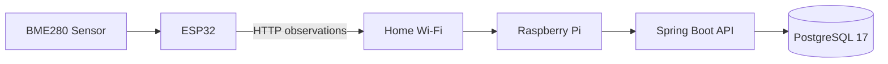
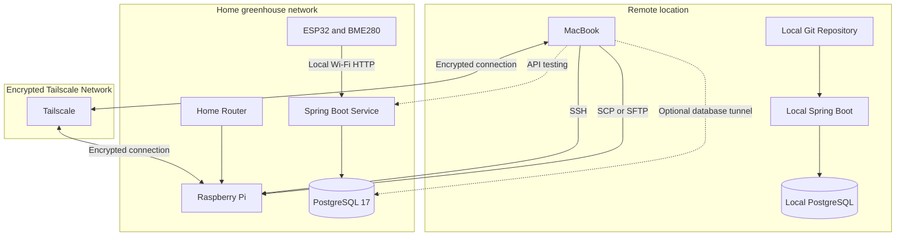
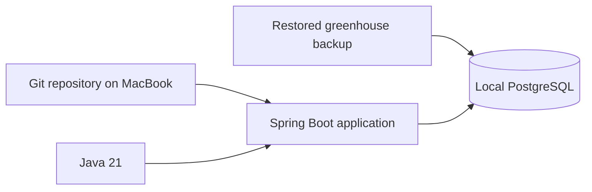
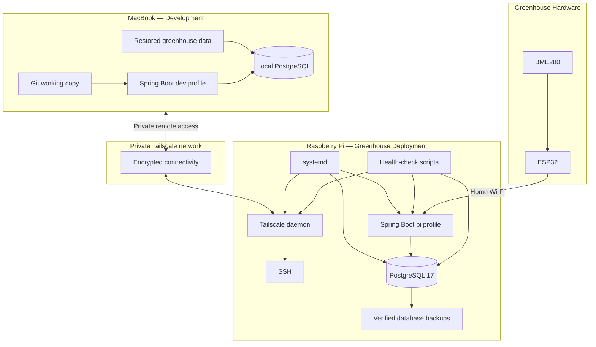

# Raspberry Pi Remote Development Readiness Specification

## 1. Purpose

Prepare the greenhouse Raspberry Pi so it can be safely accessed and managed remotely while the owner is away for three weeks.

The Raspberry Pi should continue operating as the greenhouse deployment environment, while software development takes place primarily on a MacBook.

The solution must support:

* Secure remote terminal access to the Raspberry Pi
* Remote access without router port forwarding
* Remote inspection of the Spring Boot application
* Remote inspection of PostgreSQL
* Secure file transfer
* Git-based deployment
* Automatic recovery after reboots or brief power outages
* Local development when the Raspberry Pi cannot be reached
* Clear operational documentation

---

## 2. Current System Context

### Raspberry Pi

* Operating system: Debian 13 `trixie`
* Architecture: `aarch64`
* Java: Java 21
* PostgreSQL: PostgreSQL 17
* Application: Spring Boot greenhouse platform
* Application deployment: executable JAR
* Likely application location:

```text
/opt/greenhouse/greenhouse-platform.jar
```

* Database name:

```text
greenhouse
```

### Current data flow



### Current persisted observation model

```text
observation
├── id                    BIGINT
├── device_id             VARCHAR(255)
├── temperature_celsius   DOUBLE PRECISION
├── humidity_percent      DOUBLE PRECISION
├── pressure_hpa          DOUBLE PRECISION
└── received_at           TIMESTAMPTZ
```

Index:

```text
(device_id, received_at DESC)
```

Device and heartbeat state may still be held in memory rather than PostgreSQL.

---

## 3. Target Architecture

Use Tailscale as the private remote network.

Do not expose SSH, PostgreSQL, or the Spring Boot API directly to the public internet.



---

## 4. Operating Model

The MacBook is the development environment.

The Raspberry Pi is the greenhouse deployment environment.


Direct editing of production files on the Raspberry Pi should be avoided except for emergency fixes.

---

## 5. Security Requirements

Claude Code must follow these constraints:

1. Do not configure public router port forwarding.
2. Do not expose TCP port `22` publicly.
3. Do not expose PostgreSQL port `5432` publicly.
4. Do not expose the Spring Boot port publicly.
5. Do not weaken SSH authentication.
6. Do not enable password-based root login.
7. Do not print secrets, credentials or authentication tokens into documentation.
8. Do not commit secrets to Git.
9. Back up configuration files before changing them.
10. Present planned changes before applying destructive or connectivity-sensitive operations.
11. Avoid changing the Pi's existing local IP configuration unless necessary.
12. Preserve ESP32-to-Pi communication over the existing home network.

---

## 6. Required Remote Capabilities

Once configured, the MacBook should be able to perform the following through Tailscale.

### SSH access

Example target command:

```bash
ssh <pi-user>@greenhouse-pi
```

The final hostname and username must be discovered rather than assumed.

### File transfer

Examples:

```bash
scp file.txt <pi-user>@greenhouse-pi:/tmp/
```

```bash
rsync -av ./docs/ <pi-user>@greenhouse-pi:/opt/greenhouse/docs/
```

### Spring Boot API access

The API should be reachable only from:

* The local home network
* Authorised Tailscale devices

Example:

```text
http://greenhouse-pi:<application-port>/api/v1/observations
```

Claude must discover the actual application port.

### PostgreSQL inspection

Direct remote PostgreSQL exposure is not required.

Prefer an SSH tunnel:

```bash
ssh -L 15432:localhost:5432 <pi-user>@greenhouse-pi
```

The MacBook can then connect to:

```text
host: localhost
port: 15432
database: greenhouse
```

Do not modify PostgreSQL to listen on all network interfaces unless there is a clearly documented need.

---

## 7. Claude Code Work Plan

Claude Code should carry out the work in the following phases.

## Phase A — Read-only discovery

First inspect the Raspberry Pi without making changes.

Collect:

```bash
hostname
hostnamectl
uname -a
cat /etc/os-release
whoami
id
ip address
ip route
ss -lntup
java -version
psql --version
git --version
systemctl --failed
systemctl status ssh
systemctl status postgresql
```

Also discover:

* Pi hostname
* Pi Linux username
* Current local IP address
* SSH configuration
* Application port
* Application JAR location
* Application service name
* Git repository location
* PostgreSQL database owner
* PostgreSQL service status
* Current firewall configuration
* Available disk space
* Current time and timezone
* Existing backup scripts
* Existing Tailscale installation or configuration

Useful read-only commands include:

```bash
df -h
free -h
timedatectl
sudo systemctl list-unit-files --type=service
sudo find /etc/systemd/system -maxdepth 2 -type f
sudo find /opt/greenhouse -maxdepth 3 -type f
sudo journalctl -u <application-service> -n 100 --no-pager
```

Do not print database passwords or secret environment variables.

### Discovery output

Produce a concise report containing:

* Current state
* Missing prerequisites
* Risks
* Proposed changes
* Exact files that would be modified
* Rollback approach

---

## Phase B — Install and configure Tailscale

Check whether Tailscale is already installed:

```bash
tailscale version
systemctl status tailscaled
```

If it is not installed, install it using the supported Debian installation approach.

Then:

1. Enable the Tailscale daemon.
2. Authenticate the Pi using an interactive or user-approved method.
3. Assign or confirm a stable device name such as:

```text
greenhouse-pi
```

4. Confirm the Pi appears in the user's Tailscale network.
5. Confirm its Tailscale IP address.
6. Confirm the Pi can be reached from the MacBook.
7. Confirm the connection remains available after reboot.

Do not place reusable authentication keys in shell history, scripts, Git, or documentation.

---

## Phase C — SSH hardening and validation

Inspect:

```text
/etc/ssh/sshd_config
/etc/ssh/sshd_config.d/
```

Desired state:

* SSH service enabled
* Public-key authentication enabled
* Root login disabled
* No public router exposure
* Password authentication disabled only after key-based access is proven
* Existing local SSH access preserved
* Tailscale access verified before restrictive changes

Before editing SSH configuration:

```bash
sudo cp <config-file> <config-file>.backup-<timestamp>
```

Validate configuration before restart:

```bash
sudo sshd -t
```

Do not close the current working SSH session until a second SSH session has connected successfully.

---

## Phase D — Spring Boot service resilience

Discover the current application service.

The target service should resemble:

```ini
[Unit]
Description=Greenhouse Platform
After=network-online.target postgresql.service
Wants=network-online.target

[Service]
Type=simple
User=<greenhouse-service-user>
WorkingDirectory=/opt/greenhouse
ExecStart=/usr/bin/java -jar /opt/greenhouse/greenhouse-platform.jar
Restart=on-failure
RestartSec=10
EnvironmentFile=-/etc/greenhouse/greenhouse.env
SuccessExitStatus=143

[Install]
WantedBy=multi-user.target
```

Do not overwrite a working service blindly. Compare the existing unit with the target requirements.

Required behaviours:

* Starts automatically on boot
* Starts after networking and PostgreSQL
* Restarts after application failure
* Does not run as root
* Logs are available through `journalctl`
* Secrets are not placed directly inside the unit file
* Application configuration is externalised where practical

Validation:

```bash
sudo systemctl daemon-reload
sudo systemctl enable <application-service>
sudo systemctl restart <application-service>
sudo systemctl status <application-service>
sudo journalctl -u <application-service> -n 100 --no-pager
```

---

## Phase E — PostgreSQL safety

Confirm:

* PostgreSQL starts automatically
* The `greenhouse` database exists
* The observation table is readable
* New sensor data is being written
* Database storage has sufficient free space
* PostgreSQL is not unnecessarily exposed to external interfaces

Suggested checks:

```bash
sudo systemctl is-enabled postgresql
sudo systemctl is-active postgresql
sudo -u postgres psql -l
sudo -u postgres psql -d greenhouse -c "\dt"
sudo -u postgres psql -d greenhouse -c \
  "SELECT COUNT(*) AS observation_count, MAX(received_at) AS latest_observation FROM observation;"
```

Do not change database ownership or authentication rules without documenting the reason.

---

## Phase F — Database backup

Create both a portable plain SQL backup and a PostgreSQL custom-format backup.

Suggested backup directory:

```text
/opt/greenhouse/backups/
```

Suggested commands:

```bash
pg_dump --format=plain --file=greenhouse-YYYYMMDD-HHMM.sql greenhouse
```

```bash
pg_dump --format=custom --file=greenhouse-YYYYMMDD-HHMM.dump greenhouse
```

The correct database user and authentication mechanism must be discovered.

After creation:

```bash
ls -lh /opt/greenhouse/backups/
sha256sum /opt/greenhouse/backups/greenhouse-*
```

Validate the custom backup:

```bash
pg_restore --list /opt/greenhouse/backups/greenhouse-YYYYMMDD-HHMM.dump
```

Copy at least one verified backup to the MacBook.

Do not treat copying PostgreSQL's live data directory as the primary backup method.

---

## Phase G — Git and deployment workflow

Discover the current repository state:

```bash
git status
git remote -v
git branch --show-current
git log -5 --oneline
```

Required rules:

* Do not discard uncommitted work.
* Do not run `git reset --hard`.
* Do not force-push.
* Do not commit secrets or generated database backups.
* Ensure backups are excluded through `.gitignore`.
* Prefer building on the MacBook or through a repeatable deployment script.
* Production deployment must use an identifiable Git commit.

Suggested deployment structure:

```text
/opt/greenhouse/
├── app/
│   └── greenhouse-platform.jar
├── backups/
├── logs/
├── repo/
└── scripts/
    ├── deploy.sh
    ├── backup-database.sh
    ├── health-check.sh
    └── status-report.sh
```

This structure is a target, not permission to move existing files without review.

---

## Phase H — Health-check scripts

Create safe operational scripts where useful.

### `health-check.sh`

It should check:

* PostgreSQL service state
* Spring Boot service state
* Tailscale service state
* API health endpoint
* Latest observation timestamp
* Disk space
* Memory usage
* Failed systemd units

Example output:

```text
Greenhouse Platform Health

Tailscale:       OK
PostgreSQL:      OK
Spring Boot:     OK
API:             OK
Latest reading:  2026-07-24T06:15:00+01:00
Disk usage:      23%
Failed services: 0
```

The script must not expose passwords or tokens.

### `status-report.sh`

This can provide a fuller diagnostic report for remote troubleshooting.

---

## Phase I — Reboot recovery test

Perform a controlled reboot only after configuration and backups are complete.

Before reboot:

* Confirm no unsafe database operation is running.
* Confirm Tailscale is enabled.
* Confirm SSH is enabled.
* Confirm PostgreSQL is enabled.
* Confirm the Spring Boot service is enabled.
* Confirm the MacBook has working Tailscale access.

After reboot verify:

```bash
tailscale status
systemctl is-active ssh
systemctl is-active postgresql
systemctl is-active <application-service>
```

Also verify:

* Remote SSH works
* API responds
* PostgreSQL contains existing data
* The ESP32 resumes sending observations
* A new observation appears after the reboot

---

## 8. Local Offline Development Requirement

The MacBook must be able to run the application without contacting the Raspberry Pi.

Target structure:



Create separate Spring profiles.

Suggested files:

```text
application.yml
application-dev.yml
application-pi.yml
application-test.yml
```

### Development profile

```yaml
spring:
  datasource:
    url: jdbc:postgresql://localhost:5432/greenhouse
    username: ${GREENHOUSE_DB_USER}
    password: ${GREENHOUSE_DB_PASSWORD}
```

### Pi profile

```yaml
spring:
  datasource:
    url: jdbc:postgresql://localhost:5432/greenhouse
    username: ${GREENHOUSE_DB_USER}
    password: ${GREENHOUSE_DB_PASSWORD}
```

Actual values must be provided through environment variables or secure local configuration.

Do not commit database passwords.

---

## 9. Remote Access Boundaries

### Permitted remotely

```text
MacBook
├── SSH to Raspberry Pi through Tailscale
├── View systemd service status
├── View application logs
├── Run health checks
├── Copy database backups
├── Pull approved Git changes
├── Deploy a new application JAR
├── Restart the application service
├── Test API endpoints
└── Use an SSH tunnel to inspect PostgreSQL
```

### Not permitted by default

```text
Internet
├── Public SSH access
├── Public PostgreSQL access
├── Public Spring Boot access
├── Anonymous dashboards
├── Router port forwarding
└── Unauthenticated administrative endpoints
```

---

## 10. Failure Scenarios

Claude Code should account for the following.

### Home internet failure

Expected result:

* Remote access becomes unavailable.
* The Pi continues collecting local sensor data.
* PostgreSQL and Spring Boot continue operating.
* MacBook development continues using the local database.

### Raspberry Pi reboot

Expected result:

* Tailscale starts automatically.
* PostgreSQL starts automatically.
* Spring Boot starts automatically.
* ESP32 reconnects and resumes sending observations.

### Spring Boot failure

Expected result:

* `systemd` attempts a controlled restart.
* Logs remain available through `journalctl`.
* PostgreSQL remains unaffected.

### PostgreSQL failure

Expected result:

* Spring Boot reports database connectivity failure.
* The failure is visible in health checks and logs.
* No automated destructive database repair is attempted.

### Storage nearly full

Expected result:

* Health check reports a warning.
* Backups and logs are reviewed.
* No files are automatically deleted without an explicit retention policy.

### Tailscale unavailable

Expected result:

* The greenhouse continues operating locally.
* No production service depends on remote connectivity.

---

## 11. Acceptance Criteria

The remote readiness work is complete when all of the following are true.

### Connectivity

* [ ] MacBook and Raspberry Pi are connected through Tailscale.
* [ ] Raspberry Pi has a stable and recognisable Tailscale device name.
* [ ] SSH works through the Tailscale hostname or IP.
* [ ] No router port forwarding has been configured.
* [ ] A second SSH session has been tested successfully.

### Application

* [ ] Spring Boot runs under `systemd`.
* [ ] Spring Boot starts automatically after reboot.
* [ ] Spring Boot restarts after an unexpected failure.
* [ ] Application logs are accessible through `journalctl`.
* [ ] The API can be tested through Tailscale.

### Database

* [ ] PostgreSQL starts automatically.
* [ ] Existing greenhouse observations remain intact.
* [ ] A plain SQL backup has been produced.
* [ ] A custom-format PostgreSQL backup has been produced.
* [ ] Backup checksums have been recorded.
* [ ] The custom backup can be listed with `pg_restore --list`.
* [ ] A backup has been copied to the MacBook.
* [ ] PostgreSQL has not been unnecessarily exposed to the network.

### Local development

* [ ] Java 21 is available on the MacBook.
* [ ] PostgreSQL is available locally.
* [ ] The greenhouse database backup can be restored locally.
* [ ] The backend can run against the local database.
* [ ] Development does not require Raspberry Pi connectivity.
* [ ] Environment-specific configuration is separated into profiles.

### Resilience

* [ ] Tailscale returns after a Pi reboot.
* [ ] SSH returns after a Pi reboot.
* [ ] PostgreSQL returns after a Pi reboot.
* [ ] Spring Boot returns after a Pi reboot.
* [ ] The ESP32 resumes observations after a Pi reboot.
* [ ] The latest observation can be verified remotely.

### Documentation

* [ ] Remote connection instructions are documented.
* [ ] Deployment instructions are documented.
* [ ] Backup instructions are documented.
* [ ] Restore instructions are documented.
* [ ] Health-check instructions are documented.
* [ ] Rollback instructions are documented.
* [ ] No secrets appear in documentation.

---

## 12. Required Documentation Output

Create the following documentation files:

```text
docs/operations/
├── remote-access.md
├── raspberry-pi-runbook.md
├── deployment-runbook.md
├── database-backup-and-restore.md
└── travelling-checklist.md
```

### `remote-access.md`

Include:

* Tailscale architecture
* MacBook connection commands
* SSH examples
* File-transfer examples
* PostgreSQL tunnel example
* API access example
* Common troubleshooting steps

### `raspberry-pi-runbook.md`

Include:

* Service names
* Important paths
* Status commands
* Log commands
* Restart commands
* Health-check command
* Reboot recovery procedure

### `deployment-runbook.md`

Include:

* Git workflow
* Build command
* Deployment command
* Service restart
* Verification
* Rollback to the previous JAR

### `database-backup-and-restore.md`

Include:

* Plain backup command
* Custom backup command
* Verification commands
* Copy-to-Mac command
* Local restore procedure
* Pi restore procedure
* Safety warnings

### `travelling-checklist.md`

Include a concise checklist for the final day before travel.

---

## 13. Claude Code Execution Instructions

Begin with read-only discovery.

Do not immediately install packages or edit configuration.

Use this process:

```text
1. Inspect
2. Report
3. Propose
4. Back up
5. Change one component
6. Validate
7. Continue
8. Reboot-test
9. Document
```

When a command requires elevated privileges, show the command and explain what it changes.

Do not make destructive changes automatically.

Do not alter working network or SSH configuration until the rollback method has been established.

At the end, provide:

1. A summary of the original state.
2. A list of all changes made.
3. A list of files created or modified.
4. The final service names and paths.
5. The final remote connection command.
6. The backup filenames and checksums.
7. The health-check result.
8. The reboot recovery test result.
9. Any unresolved risks.
10. The exact commands the owner should keep available while travelling.

---

## 14. Final Target State



The Raspberry Pi must remain capable of running the greenhouse independently even when the MacBook, Tailscale network or external internet connection is unavailable.
